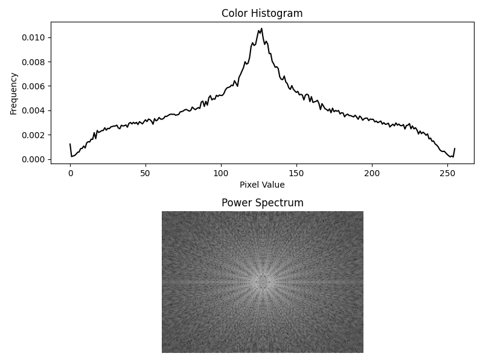
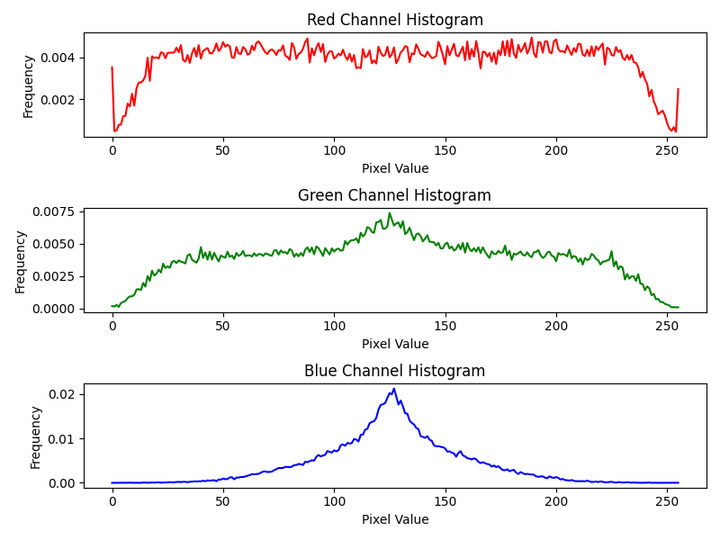
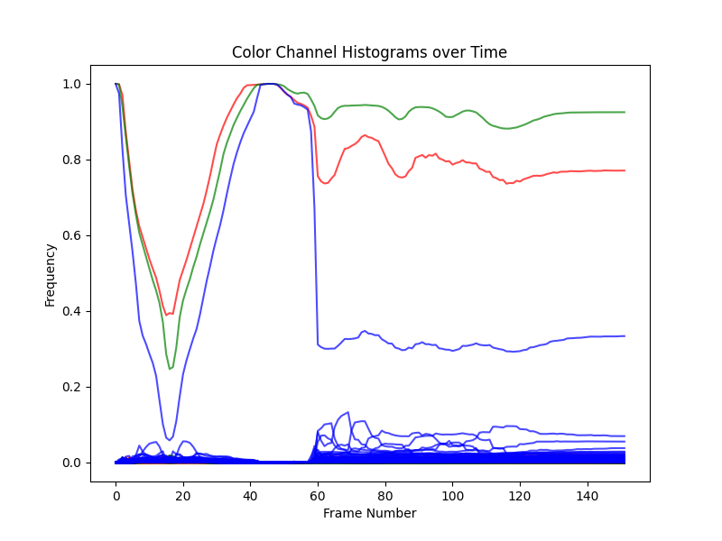
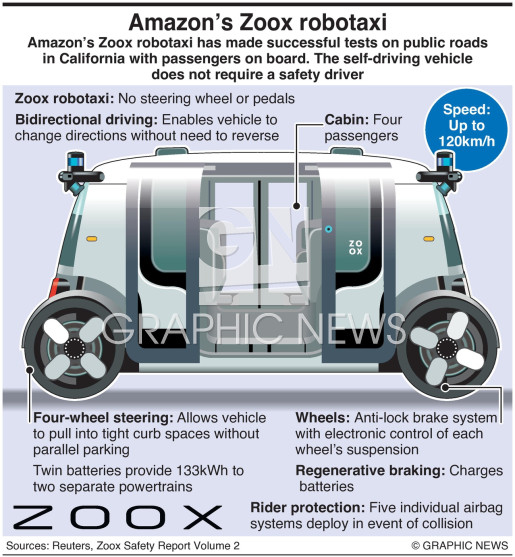

# Image Processing with Python

# Abstract:

This project explores the application of signal processing techniques in image analysis. It covers various concepts, including pixel, frequency domain analysis, denoising methods, and the integration of Google's Tesseract OCR engine. The project aims to provide a comprehensive understanding of image processing fundamentals and their practical applications. It includes code examples, graphs, and real-world examples to illustrate the effectiveness of different techniques.

Denoising Techniques for Self-Driving Technology:
This section focuses on denoising methods for improving image quality in self-driving technology. It discusses techniques such as Gaussian blur, median filtering, bilateral filtering, non-local means denoising, and deep learning-based denoising. The importance of denoising for accurate perception and decision-making in self-driving applications is emphasized.

Graphs:
The project includes several graphs to visualize and demonstrate the concepts discussed. The graphs cover topics such as , power spectrum analysis, grayscale color histograms, color channel histograms, and dynamic changes in color distribution over time in videos.

Conclusion:
By exploring signal processing techniques for image analysis and text detection, this project provides a comprehensive understanding of the subject. It highlights the significance of denoising methods in self-driving technology and showcases the practical application of image processing techniques. The inclusion of code examples, graphs, and real-world examples enhances the learning experience and illustrates the effectiveness of different techniques.

## Overview

This project focuses on image processing techniques using Python. The project aims to provide a comprehensive understanding of image processing fundamentals and their practical applications.

Theory of Image Processing

Image processing is a field of study that focuses on the analysis, manipulation, and understanding of images using computational techniques. It encompasses a wide range of algorithms and methodologies that aim to enhance, transform, and extract meaningful information from digital images.

Image Representation:
Digital images are represented as a grid of pixels, where each pixel corresponds to a specific location and contains numerical values that represent its color or intensity. The most common representations are grayscale images, where each pixel value represents the intensity of gray, and color images, where each pixel consists of multiple color channels such as red, green, and blue (RGB).

Image Filtering and Enhancement:
Filtering techniques are used to modify images by applying mathematical operations on individual pixels or small neighborhoods of pixels. Common filtering operations include blurring, sharpening, noise reduction, edge detection, and image enhancement. These operations can improve image quality, remove unwanted artifacts, and highlight specific features.

Image Transformations:
Image transformations involve geometric and spatial manipulations of images. These transformations include scaling, rotation, translation, and perspective transformation, which can be used for image alignment, registration, or correction of geometric distortions. Additionally, spatial transformations, such as histogram equalization, contrast stretching, and gamma correction, can be applied to adjust the overall appearance of an image.

Image Segmentation:
Image segmentation aims to partition an image into meaningful regions or objects. It involves identifying boundaries or boundaries between different objects based on properties such as intensity, color, texture, or motion. Segmentation techniques enable object recognition, tracking, and analysis in various applications like medical imaging, object detection, and computer vision.

Feature Extraction:
Feature extraction involves identifying and extracting relevant information or features from an image. These features can be local, such as corners, edges, or texture patterns, or global, such as shape descriptors or statistical properties. Feature extraction plays a crucial role in tasks like object recognition, image classification, and pattern analysis.

Image Compression:
Image compression techniques aim to reduce the size of image data while preserving essential visual information. Lossless compression methods store image data without any loss of information, while lossy compression methods remove non-essential details based on perceptual criteria. Image compression is vital for efficient storage, transmission, and streaming of images in various domains like multimedia, internet, and remote sensing.

Image Reconstruction and Restoration:
Image reconstruction and restoration techniques are used to recover or improve the quality of degraded or corrupted images. These techniques include image inpainting, super-resolution, deblurring, and denoising. They utilize statistical models, optimization algorithms, and machine learning approaches to recover missing or corrupted image information.

Image Analysis and Understanding:
Image analysis involves higher-level processing and interpretation of images to extract meaningful information and understand the content. This includes object detection, recognition, tracking, scene understanding, and image-based modeling. Advanced techniques such as deep learning and computer vision algorithms are widely used to analyze complex images and extract high-level semantic information.

The theory of image processing provides a foundation for developing algorithms, techniques, and methodologies to process, analyze, and interpret images. It combines principles from various disciplines, including mathematics, signal processing, statistics, and computer science. By understanding and applying this theory, researchers and practitioners can address a wide range of image-related challenges and develop innovative solutions in fields such as medicine, surveillance, robotics, entertainment, and scientific research.

## Installation

To run the code in this project, you need to have Python installed. Additionally, you'll need the following libraries:

- NumPy: `pip install numpy`
- OpenCV: `pip install opencv-python`
- Matplotlib: `pip install matplotlib`
- Pillow: `pip install pillow`
- Tesseract OCR: Follow the installation instructions [here](https://github.com/tesseract-ocr/tesseract/wiki) to install Tesseract OCR.

## Usage

1. Clone this repository to your local machine.
2. Open a terminal or command prompt and navigate to the project directory.
3. Run the Python scripts using the command `python script_name.py`.
4. Follow the instructions in each script to perform different image processing tasks.

#### Graphs

*Fig. 1: Grayscale Color Histogram and Power Spectrum*

*Fig. 2: RGB Color Model Histogram for each channel*

*Fig. 3: Dynamic Changes in RGB Histogram Over Time *

*Fig. 3: Image that is used to detect text*

## Additional Resources

- [OpenCV Documentation](https://docs.opencv.org/): Official documentation for OpenCV.
- [Matplotlib Documentation](https://matplotlib.org/stable/contents.html): Official documentation for Matplotlib.
- [Pillow Documentation](https://pillow.readthedocs.io/en/stable/): Official documentation for Pillow.
- For the purposes of this project the analyzed video was downloaded from https://zoox.com/ 
---